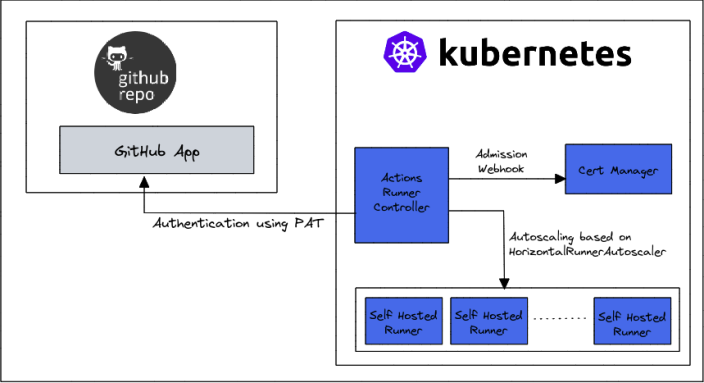

# K8s-ActionRunners

## Overview

**K8s-ActionRunners** is a Kubernetes-based solution for deploying and managing GitHub Actions self-hosted runners. By leveraging Kubernetes' scalability and orchestration capabilities, this project helps optimize costs, enhance security, and boost performance for CI/CD pipelines.

### Key Features
- **Dynamic Scaling**: Automatically scales runners based on workload.
- **Cost Efficiency**: Optimizes resource utilization by scaling up/down as needed.
- **Improved Security**: Runs each workflow in an isolated Kubernetes pod.
- **High Performance**: Reduces execution time for GitHub Actions.

---

## Project Components

### 1. Runner Deployment (`runner.yaml`)

Defines the deployment of GitHub self-hosted runners in Kubernetes.

### 2. Horizontal Runner Autoscaler (`horizontal_runner_autoscaler.yaml`)
Automatically scales the number of runners based on workload metrics.

### 3. GitHub Actions Workflow (`.github/workflows/test.yaml`)
Demonstrates a simple workflow using self-hosted runners.


## Setup

### Prerequisites

To set up the project, you'll need the following tools:

1. **Kubernetes Cluster**  
   &nbsp; Kubernetes cluster to deploy and manage the self-hosted GitHub Action runners.

2. **Helm**  
   &nbsp; Helm is a package manager for Kubernetes, which simplifies deployment and management of applications on Kubernetes.

3. **GitHub Personal Access Token (PAT)**  
   &nbsp; A GitHub Personal Access Token with the following scopes:
   A GitHub Personal Access Token with the following scopes:
   - `repo`: Full control of private repositories.
   - `admin:org`: Full control over organization resources.
   
   [Generate a GitHub PAT](https://github.com/settings/tokens)

## Installation Steps

### 1. Install the Actions Runner Controller:
```bash
helm repo add actions-runner-controller https://actions-runner-controller.github.io/actions-runner-controller
helm upgrade --install --namespace actions-runner-system --create-namespace actions-runner-controller actions-runner-controller/actions-runner-controller
```
### 2. Deploy the Runner:
```bash
kubectl apply -f runner.yaml
```
### 3. Configure Autoscaling:
```bash
kubectl apply -f horizontal_runner_autoscaler.yaml
```
### 4. Push Workflow to GitHub:
Commit and push .github/workflows/test.yaml to your repository.



## Usage

### Dynamic Scaling

The **Horizontal Runner Autoscaler** will dynamically adjust the number of runners based on the workload:

- **Scale Up**: When more than 75% of runners are busy.
- **Scale Down**: When less than 30% of runners are busy.

### Workflow Execution

The sample workflow demonstrates the following jobs:

- **Job 1**: Adds numbers and uploads the result.
- **Job 2**: Multiplies the result from Job 1 and uploads it.
- **Job 3**: Downloads and displays the final result.

### Monitoring

You can monitor the status of your runners and view logs:

- **Check the status of runners**:
  ```bash
  kubectl get pods -n actions-runner-system

- **View logs**:
```bash
kubectl logs <runner-pod-name> -n actions-runner-system
```
